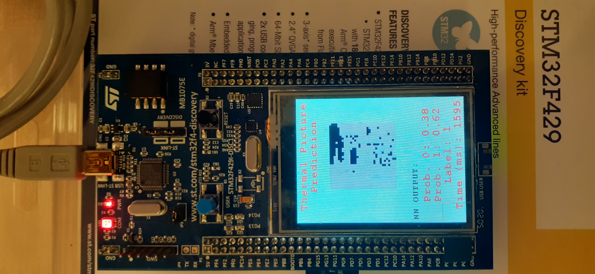

# EdgeML_STM32F4
Implemented machine learning on the STM32F4 model, executing real-time inference with visual feedback on the board's LED-screen. This project is using STM32CubeMX.

This project shows MNIST, but the same code is used for different applications, as the model can be interchanged to whatever purpose as long as it fits the memory limitations.

